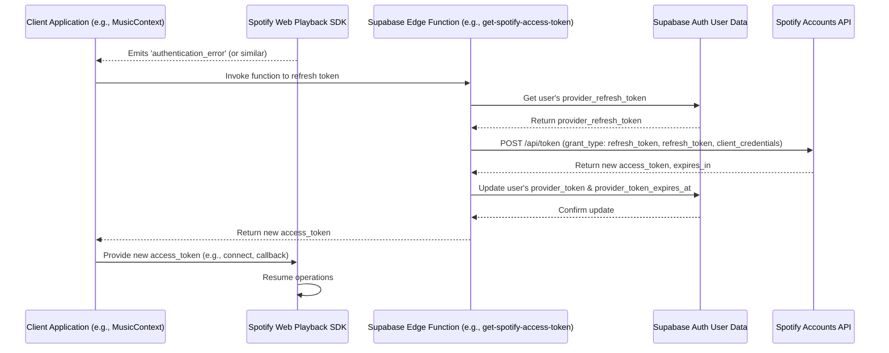

# Technical Document: Implementing Spotify Access Token Refresh

**Version:** 1.0
**Date:** October 26, 2023
**Author:** AI Assistant

## 1. Introduction & Goal

This document outlines the technical implementation for refreshing Spotify access tokens that are specific to a user. This is crucial for applications using the Spotify Web Playback SDK, as user access tokens have a limited lifetime (typically 1 hour) and must be refreshed to maintain uninterrupted playback and API access without requiring the user to log in again.

The goal is to create a secure and reliable server-side mechanism, invoked by the client, that handles the token refresh process with Spotify and updates the user's session data in Supabase.

## 2. Prerequisites

*   **Supabase Project:** A Supabase project with Supabase Auth configured.
*   **Spotify OAuth Provider:** Spotify configured as an OAuth provider within Supabase Auth. This setup ensures that Supabase Auth stores the user's `provider_token` (access token) and `provider_refresh_token` in the user's metadata upon successful login.
*   **Spotify Application Credentials:**
    *   `SPOTIFY_CLIENT_ID`: Your Spotify application's Client ID.
    *   `SPOTIFY_CLIENT_SECRET`: Your Spotify application's Client Secret. These must be securely stored as environment variables on the server-side (e.g., in Supabase Edge Function settings).
*   **Client-Side Spotify SDK Integration:** A client application (e.g., React) with the Spotify Web Playback SDK integrated (like in `MusicContext.tsx`).

## 3. Architectural Overview

The token refresh process involves the client application, a Supabase Edge Function (acting as the secure server-side component), and the Spotify Accounts service.

**Flow:**

1.  The **Spotify Web Playback SDK** on the client detects an expired or invalid access token (e.g., via an `authentication_error` event).
2.  The **Client Application** (e.g., `MusicContext.tsx`) catches this error and invokes a dedicated Supabase Edge Function (e.g., `get-spotify-access-token`).
3.  The **Supabase Edge Function** receives the request. Since it's an authenticated Supabase function call, it can identify the user.
4.  The Edge Function retrieves the user's stored `provider_refresh_token` from their Supabase Auth metadata.
5.  The Edge Function makes a secure, server-to-server POST request to the Spotify Accounts API (`https://accounts.spotify.com/api/token`) including:
    *   `grant_type: 'refresh_token'`
    *   The user's `refresh_token`.
    *   `Authorization: Basic <base64_encoded(SPOTIFY_CLIENT_ID:SPOTIFY_CLIENT_SECRET)>`.
6.  **Spotify** validates the request and, if successful, returns a new `access_token` and its `expires_in` duration. (Note: Spotify usually does not return a new refresh token during this flow; the original one remains valid).
7.  The **Supabase Edge Function** securely updates the calling user's Supabase Auth metadata with the new `provider_token` and its calculated `provider_token_expires_at` timestamp.
8.  The Edge Function returns the new `access_token` (and optionally its expiry) to the client.
9.  The **Client Application** receives the new access token and provides it to the Spotify SDK (e.g., by re-initializing or reconnecting the player, or calling the callback function if the SDK requested a token).

**Diagram (Mermaid Sequence):**



## 4. Detailed Implementation

### 4.1. Client-Side: Triggering the Refresh

The client-side code, typically within a React Context or hook managing the Spotify SDK (e.g., `MusicContext.tsx`), needs to handle SDK events that indicate an authentication issue.

**Example (conceptual, based on `MusicContext.tsx`):**

```typescript
// In MusicContext.tsx or a similar client-side SDK manager

// ... existing player setup ...

// Listener for authentication errors from the SDK
player.addListener('authentication_error', async ({ message }) => {
  console.error(`Spotify SDK Authentication Error: ${message}`);
  setErrorState(`Spotify authentication error. Attempting to refresh token...`); // Inform user

  try {
    const supabase = createClient(); // Get Supabase client instance
    // Invoke the Supabase Edge Function
    const { data: refreshedTokenData, error: refreshError } = await supabase.functions.invoke(
      'get-spotify-access-token', // Name of your Supabase Edge Function
      // Optionally pass an empty body or specific parameters if your function expects them
      { body: {} } 
    );

    if (refreshError) {
      throw refreshError;
    }

    if (refreshedTokenData && refreshedTokenData.accessToken) {
      // Update local token reference used by SDK's getOAuthToken callback
      tokenRef.current = refreshedTokenData.accessToken;
      setSpotifyTokenState(refreshedTokenData.accessToken); // Update React state if necessary

      // Attempt to reconnect the player or notify SDK of new token
      if (playerRef.current) {
        await playerRef.current.connect();
        console.log('Spotify player reconnected after token refresh.');
        setErrorState(null); // Clear error
      }
    } else {
      throw new Error('Failed to retrieve a valid new access token from refresh function.');
    }
  } catch (error) {
    console.error('Failed to refresh Spotify token:', error);
    setErrorState('Failed to refresh Spotify session. Please try logging out and back in.');
    // Potentially sign the user out or guide them to re-authenticate
  }
});

// The getOAuthToken callback for the SDK should use tokenRef.current
const getOAuthToken: Spotify.PlayerInit['getOAuthToken'] = useCallback(async (cb) => {
  const token = tokenRef.current;
  if (token) {
    cb(token);
  } else {
    // If no token, might need to trigger login or the refresh flow above
    // For simplicity, providing empty might let SDK error out, triggering the listener.
    cb(''); 
  }
}, []);

// ... rest of the context ...
```

### 4.2. Server-Side: Performing the Refresh (Supabase Edge Function)

Create a Supabase Edge Function (e.g., named `get-spotify-access-token`). This function will handle the secure refresh process.

**File structure (example):** `supabase/functions/get-spotify-access-token/index.ts`

**Implementation (`index.ts`):**

```typescript
import { serve } from 'https://deno.land/std@0.177.0/http/server.ts';
import { createClient } from 'https://esm.sh/@supabase/supabase-js@2';
import { corsHeaders } from '../_shared/cors.ts'; // Common CORS headers

interface SpotifyRefreshedTokenResponse {
  access_token: string;
  token_type: string;
  scope: string;
  expires_in: number;
  // Note: Spotify usually doesn't return a new refresh_token here
}

serve(async (req) => {
  // Handle CORS preflight request
  if (req.method === 'OPTIONS') {
    return new Response('ok', { headers: corsHeaders });
  }

  try {
    // 1. Create a Supabase client with the service role key for admin operations
    //    or use the user's auth context if function is invoked with user's JWT.
    //    For updating user metadata, admin client is often needed.
    const supabaseAdminClient = createClient(
      Deno.env.get('SUPABASE_URL')!,
      Deno.env.get('SUPABASE_SERVICE_ROLE_KEY')!, // Use service role for admin tasks
    );

    // 2. Get the user making the request.
    //    The user's JWT is automatically passed in the Authorization header by supabase.functions.invoke
    const { data: { user }, error: userError } = await supabaseAdminClient.auth.getUser(
      req.headers.get('Authorization')?.replace('Bearer ', '')
    );

    if (userError || !user) {
      console.error('User not found or auth error:', userError);
      return new Response(JSON.stringify({ error: 'Authentication required or user not found.' }), {
        status: 401,
        headers: { ...corsHeaders, 'Content-Type': 'application/json' },
      });
    }

    // 3. Retrieve the user's stored provider_refresh_token
    const providerRefreshToken = user.user_metadata?.provider_refresh_token;

    if (!providerRefreshToken) {
      console.error('No provider_refresh_token found for user:', user.id);
      return new Response(JSON.stringify({ error: 'Spotify refresh token not found for user. Please re-authenticate.' }), {
        status: 400, // Bad Request or 401 if preferred
        headers: { ...corsHeaders, 'Content-Type': 'application/json' },
      });
    }

    // 4. Get Spotify credentials from environment variables
    const clientId = Deno.env.get('SPOTIFY_CLIENT_ID');
    const clientSecret = Deno.env.get('SPOTIFY_CLIENT_SECRET');

    if (!clientId || !clientSecret) {
      console.error('SPOTIFY_CLIENT_ID or SPOTIFY_CLIENT_SECRET not set in Edge Function environment.');
      return new Response(JSON.stringify({ error: 'Server configuration error.' }), {
        status: 500,
        headers: { ...corsHeaders, 'Content-Type': 'application/json' },
      });
    }

    // 5. Make the POST request to Spotify to refresh the token
    const spotifyResponse = await fetch('https://accounts.spotify.com/api/token', {
      method: 'POST',
      headers: {
        'Content-Type': 'application/x-www-form-urlencoded',
        'Authorization': 'Basic ' + btoa(`${clientId}:${clientSecret}`),
      },
      body: new URLSearchParams({
        grant_type: 'refresh_token',
        refresh_token: providerRefreshToken,
      }),
    });

    if (!spotifyResponse.ok) {
      const errorBody = await spotifyResponse.json().catch(() => ({ error: 'Unknown Spotify API error during token refresh.' }));
      console.error('Spotify token refresh failed:', spotifyResponse.status, errorBody);
      // If refresh token is invalid (e.g., revoked), user needs to re-authenticate fully
      if (spotifyResponse.status === 400 && errorBody.error === 'invalid_grant') {
         return new Response(JSON.stringify({ error: 'Invalid refresh token. Please re-authenticate with Spotify.' }), {
          status: 401, // Unauthorized, as refresh token is bad
          headers: { ...corsHeaders, 'Content-Type': 'application/json' },
        });
      }
      return new Response(JSON.stringify({ error: 'Failed to refresh Spotify token.', details: errorBody }), {
        status: spotifyResponse.status,
        headers: { ...corsHeaders, 'Content-Type': 'application/json' },
      });
    }

    const refreshedData = await spotifyResponse.json() as SpotifyRefreshedTokenResponse;

    // 6. Update Supabase user metadata with the new token and expiry
    const newExpiresAt = Math.floor(Date.now() / 1000) + refreshedData.expires_in;
    const { error: updateError } = await supabaseAdminClient.auth.admin.updateUserById(
      user.id,
      { 
        user_metadata: { 
          ...user.user_metadata, // Preserve existing metadata
          provider_token: refreshedData.access_token,
          provider_token_expires_at: newExpiresAt,
          // provider_refresh_token usually doesn't change, but if Spotify ever sends a new one, update it.
          // provider_refresh_token: refreshedData.refresh_token || providerRefreshToken, 
        }
      }
    );

    if (updateError) {
      console.error('Failed to update user metadata with new token:', updateError);
      // Still return the new token to the client for immediate use, but log persistence error
      // Or, decide to return an error if persistence is critical before use.
      // For now, let's prioritize returning token for UX, but this is a design choice.
    }

    // 7. Return the new access token to the client
    return new Response(JSON.stringify({ 
      accessToken: refreshedData.access_token,
      expiresAt: newExpiresAt 
    }), {
      headers: { ...corsHeaders, 'Content-Type': 'application/json' },
      status: 200,
    });

  } catch (error) {
    console.error('Unexpected error in get-spotify-access-token function:', error);
    return new Response(JSON.stringify({ error: 'Internal server error: ' + error.message }), {
      status: 500,
      headers: { ...corsHeaders, 'Content-Type': 'application/json' },
    });
  }
});
```

**Deployment:**
Deploy this function to your Supabase project (e.g., via `supabase functions deploy get-spotify-access-token --no-verify-jwt` if you handle auth manually as shown, or rely on implicit JWT verification). If relying on implicit JWT, you might use `createClient(req.headers.get('Authorization'))` for user-specific operations if you don't need admin rights. However, updating user metadata often requires admin privileges (`service_role_key`).

## 5. Environment Variables

The Supabase Edge Function requires the following environment variables to be set in its Supabase project settings:

*   `SPOTIFY_CLIENT_ID`: Your Spotify application's Client ID.
*   `SPOTIFY_CLIENT_SECRET`: Your Spotify application's Client Secret.
*   `SUPABASE_URL`: Your Supabase project URL (usually auto-injected).
*   `SUPABASE_SERVICE_ROLE_KEY`: Your Supabase project's service role key (for admin operations like updating user metadata).

## 6. Security Considerations

*   **Client Secret:** The `SPOTIFY_CLIENT_SECRET` must **never** be exposed to the client-side application. It should only be used within the secure server environment of the Supabase Edge Function.
*   **Refresh Token Storage:** Supabase Auth handles the secure storage of the `provider_refresh_token`.
*   **Function Security:**
    *   The Supabase Edge Function should ideally require authentication to ensure only logged-in users can trigger it. The example uses the user's JWT to identify them.
    *   CORS headers should be configured appropriately for your domain.
*   **Admin Privileges:** Using the `SUPABASE_SERVICE_ROLE_KEY` grants broad permissions. Ensure the Edge Function's logic is tightly scoped to only perform necessary actions.

## 7. Error Handling

*   **Client-Side:** The client application should gracefully handle errors from the token refresh process, potentially guiding the user to re-login if the refresh token itself becomes invalid (e.g., revoked by the user on Spotify's side).
*   **Server-Side (Edge Function):**
    *   Log errors comprehensively.
    *   Return meaningful error responses to the client.
    *   Specifically handle cases like an `invalid_grant` error from Spotify, which indicates the refresh token is no longer valid and the user must fully re-authenticate.
    *   Handle failures in updating Supabase user metadata.

This document provides a comprehensive guide to implementing Spotify access token refresh. The specific code snippets may need minor adjustments based on your exact project structure and error handling preferences. 